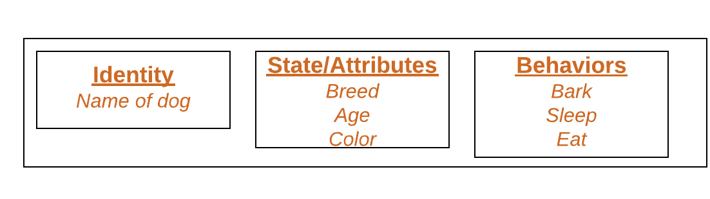
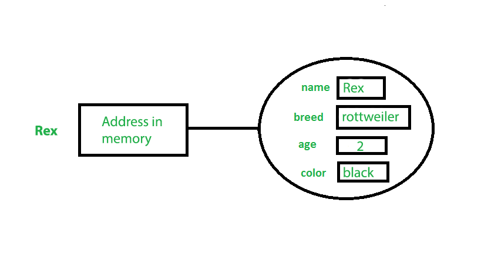

# Classes and Objects in Java

## <p align=center><b>Class</b></p>
A class is a user defined blueprint or prototype from which objects are created.  It represents the set of properties or methods that are common to all objects of one type. In general, class declarations can include these components, in order:
1. **Modifiers**: A class can be public or has default access (*Refer [this][1] for details*).
2. **class keyword**: class keyword is used to create a class.
3. **Class name**: The name should begin with an initial letter (*capitalized by convention*).
4. **Superclass(if any)**: The name of the class’s parent (*superclass*), if any, preceded by the keyword extends. A class can only extend (*subclass*) one parent.
5. **Interfaces(if any)**: A comma-separated list of interfaces implemented by the class, if any, preceded by the keyword implements. A class can implement more than one interface.
6. **Body**: The class body surrounded by braces, *{ }*.

Constructors are used for initializing new objects. Fields are variables that provides the state of the class and its objects, and methods are used to implement the behavior of the class and its objects.
There are various types of classes that are used in real time applications such as [nested classes][2], [anonymous classes][3], [lambda expressions][4]. 

---

## <p align=center><b>Object</b></p>
It is a basic unit of Object-Oriented Programming and represents the real life entities.  A typical Java program creates many objects, which as you know, interact by invoking methods. An object consists of: 

1. **State**: It is represented by attributes of an object. It also reflects the properties of an object.
2. **Behavior**: It is represented by methods of an object. It also reflects the response of an object with other objects.
3. **Identity**: It gives a unique name to an object and enables one object to interact with other objects.
Example of an object: dog

### Dog as object:


Objects correspond to things found in the real world. For example, a graphics program may have objects such as *"circle"*, *"square"*, *"menu"*. An online shopping system might have objects such as *"shopping cart"*, *"customer"*, and *"product"*. 

## Declaring Objects *(Also called instantiating a class)*
When an object of a class is created, the class is said to be **instantiated**. All the instances share the attributes and the behavior of the class. But the values of those attributes, i.e. the state are unique for each object. A single class may have any number of instances.

### Declaring object:


As we declare variables like (*type name;*). This notifies the compiler that we will use name to refer to data whose type is type. With a primitive variable, this declaration also reserves the proper amount of memory for the variable. So for reference variable, type must be strictly a concrete class name. In general, we **can’t create objects** of **an abstract class** or an **interface**.

#### Example:
```java
Dog rex;
```

If we declare reference variable (*rex*) like this, its value will be undetermined (*null*) until an object is actually created and assigned to it. **Simply declaring** a reference variable **doesn't create an object**.

## Initializing an object
The new operator instantiates a class by allocating memory for a new object and returning a reference to that memory. The new operator also invokes the class constructor. 

#### Example:
```java
public class Dog                            // CLASS DECLARATION
{
    String name;                            // Instance fields
    String breed;
       int age;
    String color;
 
    public Dog( String name,                // CONSTRUCTOR
                String breed,
                   int age,
                String color)
    {
        this.name   = name;
        this.breed  = breed;
        this.age    = age;
        this.color  = color;
    }
 
    public String getName()                 // METHOD
    {
        return name;
    }
 
    public String getBreed()                // METHOD
    {
        return breed;
    }
 
    public int getAge()                     // METHOD
    {
        return age;
    }
 
    public String getColor()                // METHOD
    {
        return color;
    }
 
    @Override
    public String toString()
    {
        return  (
                   "I'm :"          + this.getName()   +
                    ".\nMy breed, age and color are: " +
                    this.getBreed() + ", " +
                    this.getAge()   + ", " +
                    this.getColor()
                );
    }
 
    public static void main(String... args)
    {
        Dog tuffy = new Dog( "Rex", "rottweiler ", 2, "black" );
        
        System.out.println(                 // Output: I'm Rex.
            tuffy.toString()                //         My breed, age and color are: 
        );                                  //         rottweiler, 2, black
    }
}
```

* This class contains a single constructor. We can recognize a **constructor** because its declaration uses *the same name as the class* and it has *no return type*. The Java compiler *differentiates* the constructors based on the *number and the type of the arguments*. The constructor in the Dog class takes four arguments. The following statement provides *"Rex"*, *"rottweiler "*, *"5"*, *"white"* as values for those arguments:

### Illustrated object "Dog":


> ***Note***: All classes have at least one constructor. If a class does not explicitly declare any, the Java compiler automatically provides a no-argument constructor *(Default constructor)*, also called the default constructor. This default constructor calls the class parent’s no-argument constructor (as it contain only one statement i.e *super();*), or the *Object* class constructor if the class has no other parent (as Object class is parent of all classes either directly or indirectly). 

## Ways to create object of a class
There are four ways to create objects in java. Strictly speaking there is only one way (by using *new* keyword), and the rest internally use *new* keyword. 
* **Using new keyword**: It is the most common and general way to create object in java.

#### Example:
```java
Test t = new Test();    // creating object of class Test
```

* **Using *Class.forName (String className)* method**: There is a pre-defined class in java.lang package with name Class. The **forName(String className)** method *returns the Class object* associated with the class with the given string name. We have to give the fully qualified name for a class. On calling **newInstance()** method on this Class object *returns new instance of the class* with the given string name.

#### Example:
```java
// creating object of public class Test (Test present in com.p1 package)
Test obj = (Test) Class.forName("com.p1.Test").newInstance();   
```

* **Using *clone()* method**: *clone()* method is present in Object class. It creates and *returns a copy of the object*.

#### Example:
```java
Test t1 = new Test();           // CREATING OBJECT of class Test
Test t2 = (Test) t1.clone();    // CREATING CLONE of above object
```

* **Deserialization**: De-serialization is *technique of **reading an object** from* the saved state in a ***file***. Refer [Serialization/De-Serialization][5] in java

#### Example:
```java
FileInputStream   file = new FileInputStream  (filename);
ObjectInputStream   in = new ObjectInputStream(file);
Object             obj = in.readObject();
```

## Creating multiple objects by one type only *(A good practice)*
* In real-time, we need different objects of a class in different methods. Creating a number of references for storing them is not a good practice and therefore we declare a static reference variable and use it whenever required. In this case, wastage of memory is less. The objects that aren't referenced anymore will be destroyed by [Garbage Collector][6] of java.

#### Example:
```java
Test test = new Test();
     test = new Test();
```

* In inheritance system, we use parent class reference variable to store a sub-class object. In this case, we can switch into different subclass objects using same referenced variable.

#### Example:
```java
class Animal {}

class Dog extends Animal {}
class Cat extends Animal {}

public class Test
{
    Animal obj = new Dog();         // using Dog object
           obj = new Cat();         // using Cat object
}    
```

## Anonymous objects
**Anonymous objects** are the *objects that are instantiated but aren't stored in a reference variable*.
* They are used for immediate method calling.
* They will be destroyed after method calling.
* They are widely used in different libraries. *For example, in AWT libraries, they are used to perform some action on capturing an event (eg 'a' key press).*
* In the example below, when 'a' key is button (referred by the *btn*) is pressed, we are simply *creating anonymous object of EventHandler* class *for just calling handle method*.

#### Example:
```java
btn.setOnAction(
    new EventHandler()                              // ANONYMOUS EventHandler Object 
    {
        public void handle(ActionEvent event)
        {
            System.out.println("Hello World!");
        }
    }
);
```
---


<!--
* [this][1]                             ->  Done!
* [nested classes][2]
* [anonymous classes][3]
* [lambda expressions][4]
* [Serialization/De-Serialization][5]
* [Garbage Collector][6]
-->

[1]: This.md
[2]: NestedClass.md
[3]: AnnonymousClass.md
[4]: LambdaExpression.md
[5]: De-Serialization.md
[6]: GarbageCollector.md