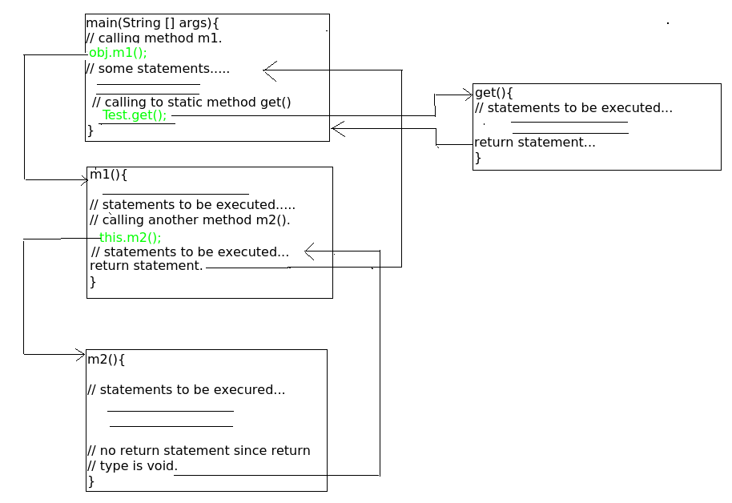

# <p align=center><b>Methods in Java</b><p>

A method is a collection of statements that perform some specific task and return the result to the caller. A method can perform some specific task without returning anything. Methods allow us to reuse the code without retyping the code. In Java, every method must be part of some class which is different from languages like C, C++, and Python. 
<br/>
Methods are time savers and help us to reuse the code without retyping the code.

## Method Declaration
In general, method declarations has six components :  
* **Modifier**: Defines **access type** of the method i.e. from where it can be accessed in your application. In Java, there 4 types of access specifiers. 
   1. **public**: accessible in all classes in your application.
   2. **protected**: accessible within the class in which it is defined and in its subclass(es)
   3. **private**: accessible only within the class in which it is defined.
   4. **default** *(declared/defined without using any modifier)*: accessible within the same class and package within which its class is defined.
* **The return type**: The data type of the value returned by the method or void if doesn't return a value.
* **Method Name**: the rules for field names apply to method names as well, but the convention is a little different.
* **Parameter list**: Comma separated list of the input parameters are defined, preceded with their data type, within the enclosed parenthesis. If there are no parameters, you must use empty parentheses *( )*.
* **Exception list**: The exceptions you expect by the method can throw, you can specify these exception(s).
* **Method body**: it is enclosed between braces. The code you need to be executed to perform your intended operations.

### Signature:


**Method signature**: It consists of the *method name* and a *parameter list* (number of parameters, type of the parameters and order of the parameters). The *return type* and *exceptions* aren't considered as part of it.

#### Example:
```java
max(int x, int y);
```

**Method naming convention**: A *method name* is typically a *single word* that *should be a verb in lowercase or multi-word*, that begins with a verb in lowercase followed by an adjective, noun….. After the first word, the *first letter of each word should be capitalized*.<br/>
**For example:** findSum, computeMax, setX and getX.<br/>
Generally, A method has a **unique name** *within the class* in which it is defined but sometimes a method might have the same name as other method names within the same class as [method overloading][1] is allowed in Java.

## Calling a method
The method needs to be called for using its functionality. There can be three situations when a method is called: 
A method returns to the code that invoked it when: 
* It completes all the statements in the method
* It reaches a return statement
* Throws an exception

#### Example:
```java
class Methods
{
    public int addTwoNumbers(int a, int b)
    {
         return a + b;
    }
}

class Applying
{
    public static void main (String... args)
    {
        Methods add = new Methods();                // addition instance

        int s = add.addTwoNumbers(-25,5);           // calling method to get the sum

        System.out.println(
            "Total: " + s                           // Output: -20
        );
   }
}
```

#### Example:
```java
class Test
{
    public static int i = 0;

    Test()                                      // constructor counts the number of the objects
    {
        i++;
    }

    public static int get()                     // STATIC gives access to total created objects numbers 
    {
        // ... some statement(s) if any...
        return i;
    }

                                                // Instance calling object directly (created inside another class)
                                                // Can called by an object created in another method of the same class
    public int m1()
    {
        System.out.println(
            "m1() called via the"       +       // OUTPUT: m1() called via the object of another class
            "object of another class"
        );

        this.m2();                              // calling m2() within the same class.

        // ... some statement(s) if any...

        return 1;                               // statements to be executed if any
    }

    public void m2()                            // Void - doesn't return anything
    {
        System.out.println(
            "m2() came from method m1"          // OUTPUT: m2() came from method m1
        );
    }
}

class Applying
{
    public static void main(String... args)
    {
        Test obj = new Test();                  // Creating an instance

        int i = obj.m1();                       // Calling m1() by the object created in above

        System.out.println(
            "Control returned after m1(): " +   // OUTPUT: Control returned after m1(): 1
            i
        );

        int noOfObjects = Test.get();           // Call m2() method obj.m2();

        System.out.print(
            "No one instances created"  + 
            "till now: "                +
            noOfObjects                         // No one instances created till now: 1
        );
    }
}
```

### Control flow of the above program:


## Memory allocation for methods calls
Methods calls are implemented through a stack. Whenever a method is called a stack frame is created within the stack area and after that, the arguments passed to and the local variables and value to be returned by this called method are stored in this stack frame and when execution of the called method is finished, the allocated stack frame would be deleted. There is a stack pointer register that tracks the top of the stack which is adjusted accordingly.

---

<!--
TODO:
Additional Information:
* Java is [strictly passed by value][2]
* [Method overloading and Null error][3] in Java
* [Overload or override static methods][4]
* [Java Quizzes][5]


  
<!--
FILE:  Methods.md
* [method overloading][1]
* [strictly passed by value][2]
* [Method overloading and Null error][3]
* [Overload or override static methods][4]
* [Java Quizzes][5]
-->

[1]: Overloading.md
[2]: StrictlyPassed.md.md
[3]: OverloadingNullError.md
[4]: OverloadStaticMethod.md
[5]: Quizzes.md

<!--[1]: Overloading.md    (https://www.geeksforgeeks.org/overloading-in-java/)-->
