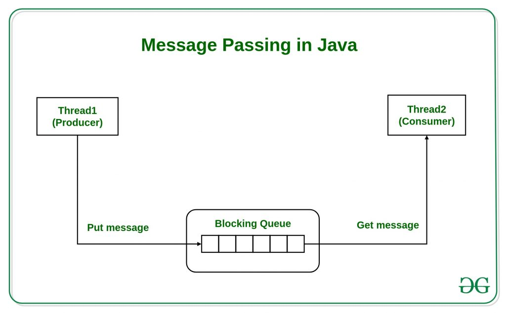

# Message Passing in Java

Message Passing in terms of computers is communication between processes. It is a *form of communication used in object-oriented programming* as well as *parallel programming*.<br/>
Message passing in Java is **like sending an object** i.e. *message from one thread to another thread*. It is used when threads don't have shared memory and are unable to share monitors or semaphores or any other shared variables to communicate.<br>
Suppose we consider an example of producer and consumer, likewise what producer will produce, the consumer will be able to consume that only. We mostly use [Queue][1] to implement communication between threads.

### Schema:


In the example explained below, we will be using vector(queue) to store the messages, 7 at a time and after that producer will wait for the consumer until the queue is empty.

In Producer there are two synchronized methods **putMessage()** which will call form **run()** method of Producer and add message in Vector whereas **getMessage()** extracts the message from the queue for the consumer.

Using message passing simplifies [the producer-consumer problem][2] as they don’t have to reference each other directly but only communicate via a queue.

#### Example:
```java
import java.util.Vector;
  
class Producer extends Thread
{
    static final int MAX = 7;                           // initialization of queue size
    private Vector messages = new Vector();
  
    @Override
    public void run()
    {
        try
        {
            while (true)
            {

                putMessage();                           // producing a message to send to the consumer

                sleep(1000);                            // producer goes to sleep when the queue is full
            }
        }
        catch (InterruptedException e){
        }
    }
  
    private synchronized void putMessage()
        throws InterruptedException
    {
        while (messages.size() == MAX)                  // checks whether the queue is full or not
            wait();                                     // waits for the queue to get empty
  
        
        messages.addElement(                            // then again adds element or messages
                    new java.util.Date()
                                 .toString()
        );
        notify();
    }
  
    public synchronized String getMessage()
        throws InterruptedException
    {
        notify();

        while (messages.size() == 0)
            wait();
        
        String message = (String) messages.firstElement();

        messages.removeElement(message);                // extracts the message from the queue

        return message;
    }
}
  
class Consumer extends Thread
{
    Producer producer;
  
    Consumer(Producer p)
    {
        producer = p;
    }
  
    @Override
    public void run()
    {
        try
        {
            while (true)                                // sends a reply to producer got a message
            {
                String message = producer.getMessage();

                System.out.println(
                    "Got message: " + message);         // Output: Thu Sep 15 08:24:23 UTC 2021
                );

                sleep(2000);
            }
        }
        catch (InterruptedException e){
        }
    }
  
    public static void main(String... args)
    {
        Producer producer = new Producer();

        producer.start();
        
        new Consumer(producer).start();
    }
}
```
---

<!--
* [Queue][1]
* [the producer-consumer problem][2]
-->

[1]: http://www.geeksforgeeks.org/queue-data-structure/
[2]: https://en.wikipedia.org/wiki/Producer%E2%80%93consumer_problem
<!--
https://www.geeksforgeeks.org/producer-consumer-solution-using-threads-java/
[2]: res/read/ProducerCustomer.md
-->